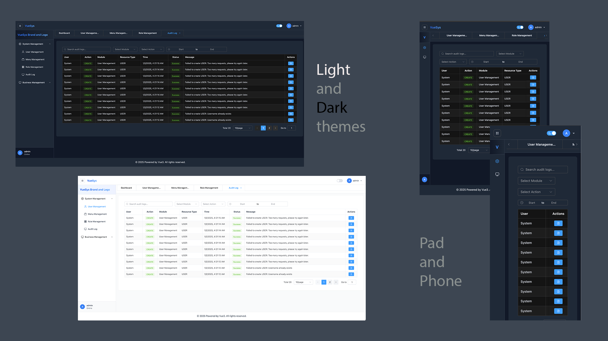

# VueSys - 管理后台前端

[English](./README.md) | 简体中文

## 概述

VueSys 是一个使用 Vue 3 构建的现代化响应式管理后台，提供全面的用户管理、基于角色的访问控制和动态菜单管理功能。
后端项目：[VueSys - 管理后台后端](https://github.com/penn201500/vuesys-django-admin-backend)



## 功能特性

-   🔐 安全认证系统
    -   基于 HttpOnly cookies 的 JWT 认证
    -   安全的访问令牌和刷新令牌处理
    -   支持带 SSL/TLS 加密的 HTTPS
    -   CSRF 防护
    -   记住我功能
    -   会话管理
    -   限流保护
-   👥 用户管理
    -   用户 CRUD 操作
    -   支持头像的个人资料管理
    -   密码管理
-   🔑 基于角色的访问控制（RBAC）
    -   角色管理
    -   权限分配
    -   基于角色的动态菜单访问
-   📱 响应式设计
    -   移动端友好界面
    -   适配所有屏幕尺寸的自适应布局
-   🎨 主题支持
    -   明暗模式
    -   主题设置持久化
-   🌐 国际化支持
    -   多语言支持
    -   便捷的语言切换
-   📊 动态标签页管理
    -   多标签页支持
    -   标签页持久化
-   🔍 高级搜索功能
    -   实时搜索
    -   过滤查询
    -   服务端分页
    -   可自定义页面大小
    -   排序功能

-   📝 全面的审计日志
    -   详细的活动追踪
    -   用户操作历史
    -   系统变更监控
    -   可搜索的审计日志
    - [ ] 过滤的审计报告

- [ ] 📧 邮件通知
    -   用户注册邮件
    -   密码重置邮件
    -   通知邮件
    -   可自定义邮件模板

- [ ] 聊天系统
    -   实时消息
    -   群聊支持
    -   消息历史
    -   消息已读状态
    -   文件附件

## 技术栈

-   **Vue 3** - 渐进式 JavaScript 框架
-   **Typescript** - 类型安全和更好的开发体验
-   **Pinia** - 状态管理
-   **Vue Router** - 导航管理
-   **Element Plus** - UI 组件库
-   **Tailwind CSS** - 实用优先的 CSS 框架
-   **Axios** - HTTP 客户端
-   **Vite** - 构建工具和开发服务器

## 前置要求

-   Node.js (v20.17)
-   npm 或 yarn
-   Git

## 安装

1. 克隆仓库

```bash
git clone [https://github.com/penn201500/vuesys-vue3-admin-frontend.git](https://github.com/penn201500/vuesys-vue3-admin-frontend.git)
cd vue3-admin-frontend
```

2. 安装依赖

```bash
npm install
# 或
yarn install
```

3. 配置环境变量
   在根目录创建 `.env.development` 文件：

```env
# .env.development
VITE_APP_BACKEND_URL=https://localhost:8000
VITE_SSL_KEY_PATH=~/localhost+2-key.pem
VITE_SSL_CERT_PATH=~/localhost+2.pem
```

### 如何创建 SSL 证书

1. 生成自签名 SSL 证书

```bash
brew install mkcert
mkcert -install  # windows 使用 'choco install mkcert'
mkcert localhost 127.0.0.1 ::1  # 这将生成 localhost+2.pem（证书）和 localhost+2-key.pem（密钥）
```

2. 使用生成的 SSL 证书路径更新 `.env.development` 文件

3. 更新 vite.config.ts

```typescript
export default defineConfig(({ mode }) => {
    const env = loadEnv(mode, process.cwd())
    return {
        server: {
            https: {
                key: fs.readFileSync(path.resolve(__dirname, env.VITE_SSL_KEY_PATH)),
                cert: fs.readFileSync(path.resolve(__dirname, env.VITE_SSL_CERT_PATH)),
            },
            port: 3000,
        },
    }
})
```

4. 启动开发服务器

```bash
npm run dev
# 或
yarn dev
```

## 开发

### 项目结构

```
src/
├── assets/          # 静态资源
├── components/      # 可复用组件
├── layouts/         # 布局组件
├── router/          # 路由配置
├── stores/          # Pinia 存储
├── types/           # TypeScript 类型定义
├── utils/           # 工具函数
└── views/           # 页面组件
```

### 添加新功能

1. 在 `components` 目录中创建新组件
2. 在 `router/index.ts` 中添加新路由
3. 如需要，在 `stores` 中创建新的存储
4. 在 `views` 目录中添加新的视图

## 贡献

1. Fork 仓库或打开 Pull Request

## 许可证

本项目基于 MIT 许可证 - 详见 [LICENSE](./LICENSE.md) 文件
